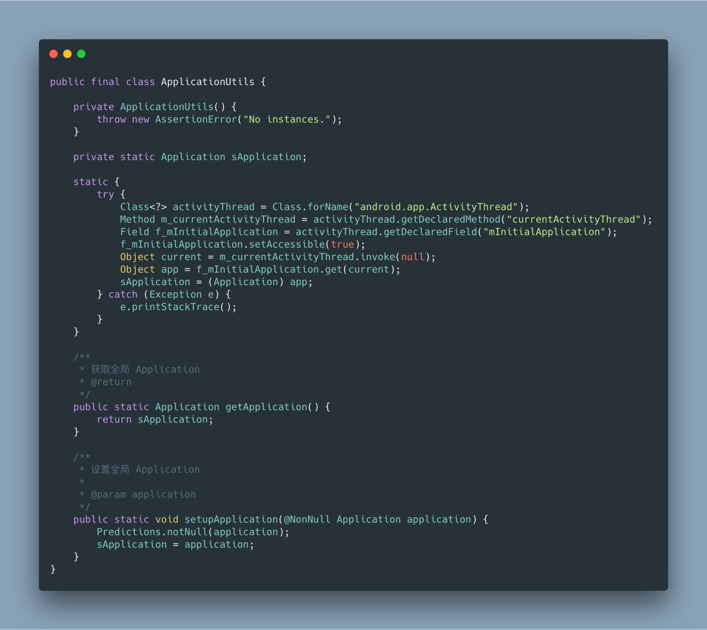
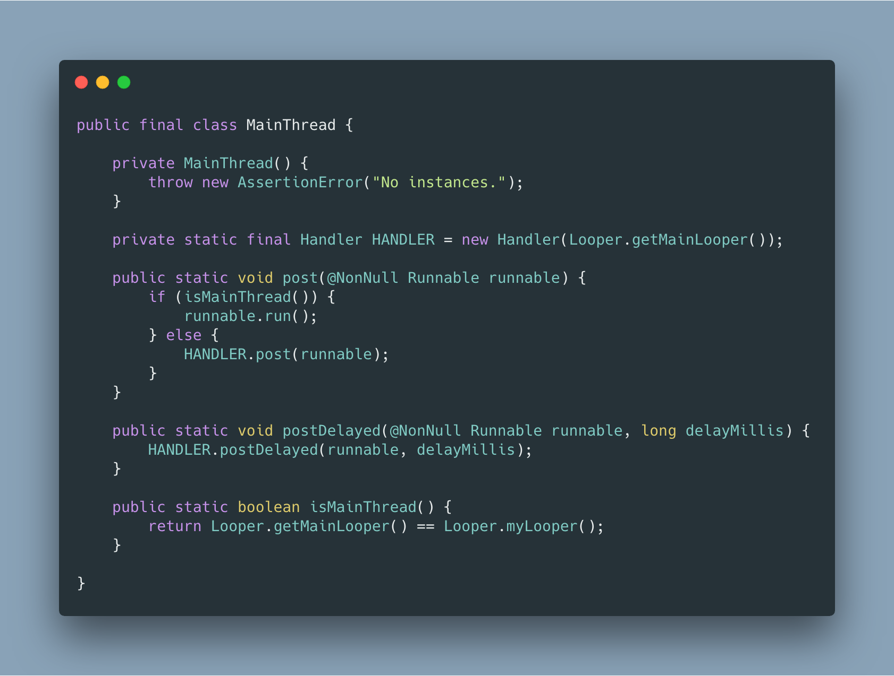
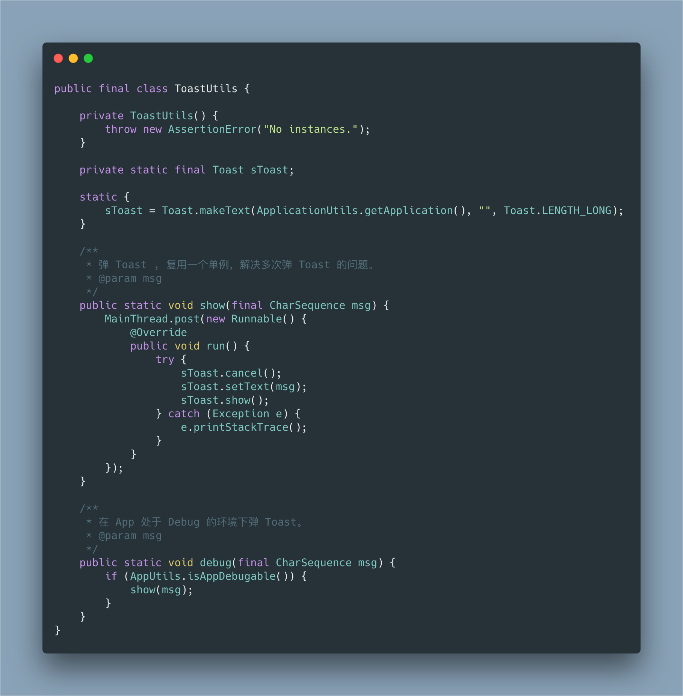
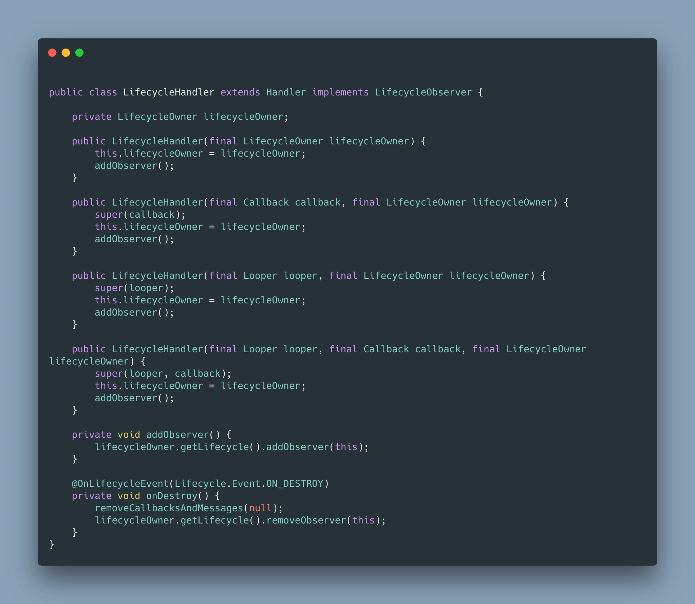
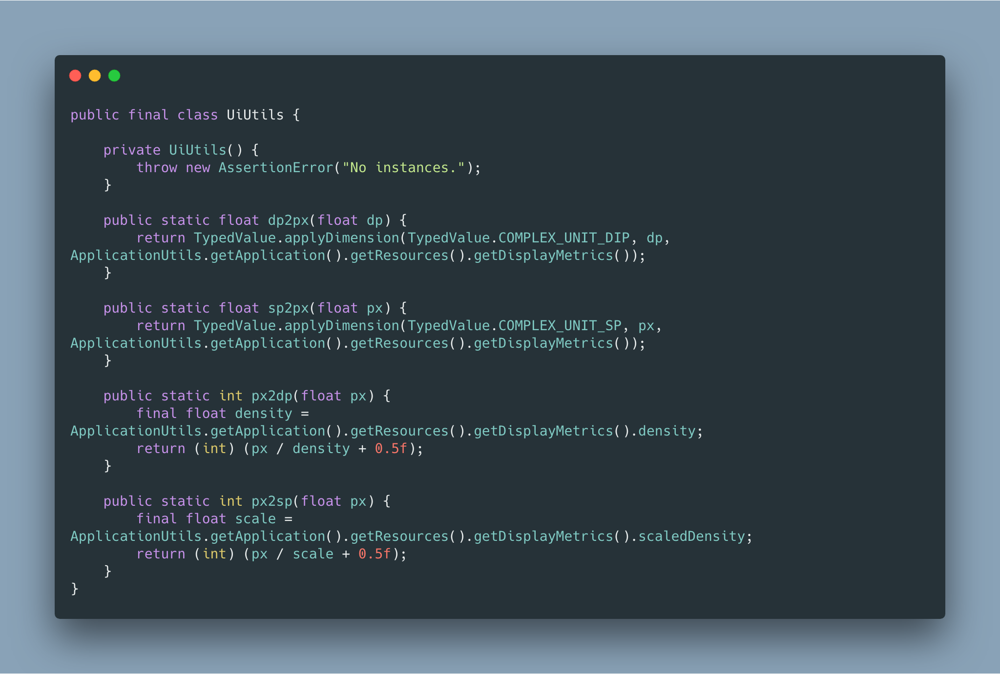
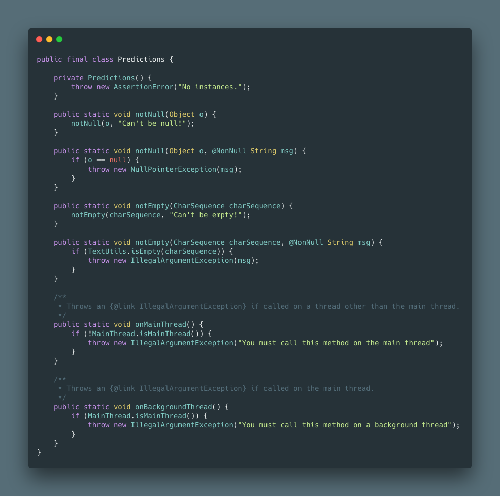

# Pandora

> Updating


> 在古希腊的神话中 Pandora 是世界上第一个女人，一个 all-gifted 的女人（具有一切天赋的女人），而潘多拉的魔盒里装着希望。


借着 `all-gifted` 的寓意，我创建了这个开源库: `Pandora`，她是一个精选的 Utils 集合。


**虽然说算是 Utils 的集合，但是跟其他的库并不同，这里的类&方法的数量非常少，我只选了极少数我觉得真的非常有用且有大概率复用的类，在保证避免编写大量样板代码的基础之上，减少引入不必要类的可能，防止包体积增大。**


目前 Pandora 由两个模块组成 ：

1. `pandora-basic` ，只包含非常非常基础的工具类 ，绝大多数 App 都需要的工具类，在保证避免编写大量样板代码的基础之上，减少引入不必要类的可能，防止包体积增大；
2. `pandora-full` ，依赖并包含 basic ，会包含各种 Utils ，可能涉及到 Android 开发的方方面面。

当只需要非常基础的能力时可以依赖 basic 版本推荐！；

当需要依赖大量 Pandora 包含的 Utils 时，才需要依赖 full 版本：`0.0.6` ，代码在 `master` 分支，不推荐！；


**推荐只依赖 basic 版本，避免引入过多不需要的类，增加包体积。**


### Getting Started


只依赖 baisc 能力:

```groovy
implementation 'me.yifeiyuan.pandora:pandora-basic:1.0.0'
```


依赖 full 能力：

```groovy
implementation 'me.yifeiyuan.pandora:pandora-full:1.0.1'
```

(full 版本包含 basic 版本的能力，所以不再需要添加 basic 的依赖)


### Basic 版本的能力介绍


努力做到真正需要才加入到 basic 版本。


> 注意: 方法可能有变，请以实际代码为准。


#### ApplicationUtils


一个可以设置、获取全局 Application 的工具类，Context 在 Android 中非常常用，但是其实很多时候我们不需要传递 Activity 类型的 Context ， **使用 `ApplicationUtils` 可以缓解我们到处传递 Context 的困境**。（默认会从 ActivityThread 获取 Application）





#### MainThread


一个关于主线程的工具类，**可以方便地将 Runnable post 到主线程执行**。





#### ToastUtils


一个全局单例 Toast ，**解决多次实例化 Toast 导致不停弹 Toast 的问题**。





#### LifecycleHandler


在使用 Handler 的时候我们总是担心 Handler 会导致内存泄露，于是我们每次都会在 onDestroy 方法里移除 Handler 的消息，编写样板代码，LifecycleHandler 的出现就是为了解决这个困境，**使用它，你不再需要关注 onDestroy 啦！**





#### UiUtils


Android 开发不可避免的要跟像素 dp 等打交道，UiUtils 包含一些数据单位转换的操作。





#### Predictions


一个用来做”断言”的功能的工具类，用来验证判断参数是否合法。

虽然我们有 NonNull 等注解 ，但是依然避免不了外部传递非法参数，这个时候我们避免不了写样板代码，检测参数是否非法，如果是则抛出异常，**Predictions 可以让你少写一些检查抛、异常的样板代码**。




